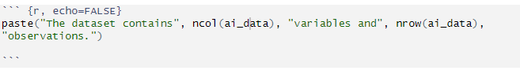

```{r Chunk 1 , include=FALSE}
library(tidyverse)
library(rmarkdown)
library(knitr)
library(tidyverse)
library(readr)
library(kableExtra)
library(ggplot2)
library(lubridate)
library(gridExtra)

```

### Research Question:

What is the trend of AI patents worldwide? Which countries are creating the most per capita and what is the trend of those specific countries?

### Data Set:

This data set is retrieved from [ourworldindata.org](https://ourworldindata.org/grapher/artificial-intelligence-patents-submitted-per-million). The data set originally consists of 4 columns:  
  
1) Entity eg. Australia  
  
2) Code eg. AUS  
  
3) Year eg. 2015  
  
4) Patents per million (from here known as ppm)

The data is transformed by pivoting the table so that it has 4 columns:

1) Country 
  
2) Patents in 2010
  
3) Patents in 2015
  
4) Patents in 2020

The variables found within are numerical ppm. These are rounded to 3 decimal places for readability purposes.

```{r}
ai_data <- read.csv("Data/ai_numbers.csv", check.names = FALSE)
ai_data$`2010` <- round(ai_data$`2010`, 2)
ai_data$`2015` <- round(ai_data$`2015`, 2)
ai_data$`2020` <- round(ai_data$`2020`, 2)

kable(head(ai_data, 5), format = "html", caption = "Top 5 Rows of AI Patent Data") %>%
  kable_styling(full_width = FALSE)
```

  
### Data set description:  
  
``` {r, echo=FALSE}
paste("The dataset contains", ncol(ai_data), "variables and", nrow(ai_data), "observations.")

```

##### Screenshot of code used to creat the above command:  
  
```{r}

```

##### Show the first rows of data and their variable types:  
  
```{r}
str(ai_data)
```

### Data Summary:

```{r}
ai_data$min_value <- apply(ai_data[, c("2010", "2015", "2020")], 1, min)
ai_data$max_value <- apply(ai_data[, c("2010", "2015", "2020")], 1, max)
ai_data$mean_value <- round(rowMeans(ai_data[, c("2010", "2015", "2020")]), 2)

result <- data.frame(
  Country = ai_data$Country,
  Min = ai_data$min_value,
  Max = ai_data$max_value,
  Mean = ai_data$mean_value)

top_5_stats <- head(result[order(result$Mean, decreasing = TRUE), ], 5)

kable(top_5_stats, format = "html", col.names = c("Country", "Min", "Max", "Mean"), caption = "Top 10 Countries by Mean AI Patents", 
      align = c('l', 'c', 'c', 'c')) %>%
  
kable_styling(full_width = FALSE)

```

This data is showing the min, max and mean of the data values shown for the top 5 countries sorted by mean patent count. Something of note here is that the rate of change seems to be more significant for South Korea. Where the other nations follow about a 10x increase, South Korea is increasing at a rate of **almost** 40x.

### Visualisations:

```{r}
print(top_5_stats)
```

```{r}

top_5 <- head(top_5_stats$Country, 5)
top_5_data <- ai_data[ai_data$Country %in% top_5, ]

world_data <- ai_data[ai_data$Country == 'World', ]

# Reshape the data into long format for ggplot for both top 5 and 'World'
top_5_data_long <- tidyr::pivot_longer(top_5_data, cols = c("2010", "2015", "2020"),
                                              names_to = "Year", values_to = "Patents")
world_data_long <- tidyr::pivot_longer(world_data, cols = c("2010", "2015", "2020"),
                                              names_to = "Year", values_to = "Patents")

combined_data <- rbind(top_5_data_long, world_data_long)
combined_data$Year <- as.numeric(gsub("X", "", combined_data$Year))
ggplot(combined_data, aes(x = Year, y = Patents, color = Country, group = Country)) +
  geom_line() +
  geom_point() +
  labs(title = "Patents over Time for Top 5 Countries and 'World'",
       x = "Year",
       y = "Number of Patents") +
  theme_minimal() +
  theme(legend.position = "right")


```

* In the above figure we see an obvious upwards trend over time.
* Most notably is the huge uptick in AI patents in South Korea.


### Conclusions:

Based on this data and the following figure we can conclude that AI Patents are ramping up over time in many developed countries. While the world as a whole is ramping up significantly as time goes on, South Korea is evidently a world leader in exploration and development of AI technologies.

Something to keep in mind is that these statistics are measuring against each other in patents per million people (ppmp). Countries like China and India who have orders of magnitude more people than countries like Australia or South Korea are likely to have far more patents coming from their shores as raw numbers. 

Looking at ppmp is interesting because it shows how a percentage of a population percieves AI and how tech focused that country is as a whole compared to others who may show less interest in developing AI technology in the future.


```{r}

```
